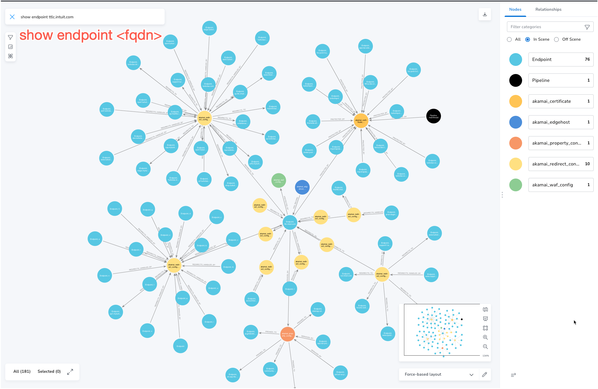
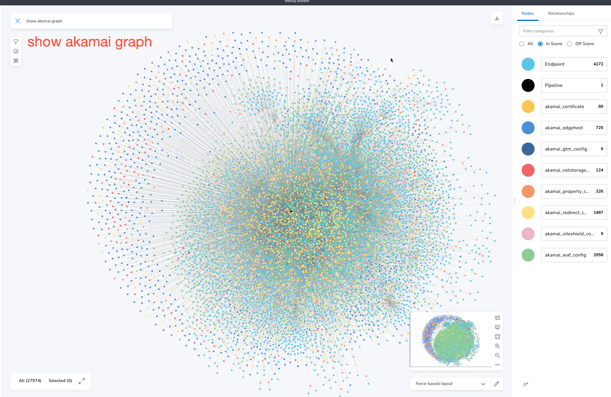
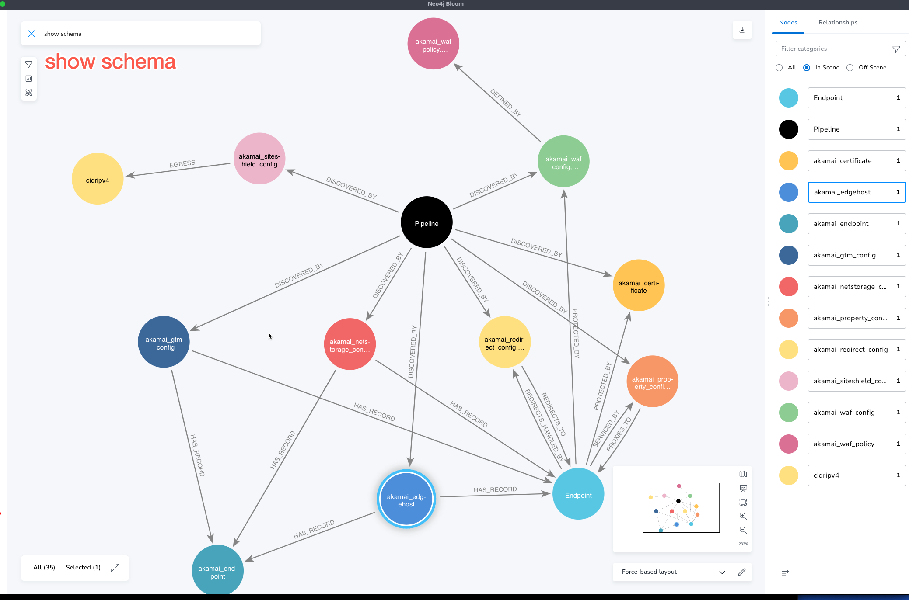

# Overview
This repo contains the scripts necessary to parse Akamai property and redirect configs
and ingest them into Neo4j.  It is a starting point to help visualize your external attack surface
within Akamai.

[LinkedIn Blog post](https://www.linkedin.com/pulse/neo4j-akamai-mapping-your-external-attack-surface-chad-cloes/?published=t&trackingId=ucgj3ZLISy6RW78UL0iYxQ%3D%3D)

# Setup Neo4j
1. Download and install Neo4j: https://neo4j.com/docs/desktop-manual/current/installation/download-installation/
1. Create and start database (version 5.7.0: https://neo4j.com/docs/desktop-manual/current/operations/create-dbms/
1. Install APOC: https://neo4j.com/docs/apoc/5/installation/

# Download Akamai credentials
1. Create and download akamai credentials: https://techdocs.akamai.com/developer/docs/set-up-authentication-credentials

NOTE: These values will be used in your `.env` 

# Install and run the app
1. Install python3: https://www.python.org/downloads/ 
1. Install poetry: https://python-poetry.org/docs/#installation 
1. Install nodestream: https://nodestream-proj.github.io/nodestream/0.5/docs/tutorial/
1. Generate a new nodestream project
1. Add `nodestream-akamai` to your project dependencies in your nodestream projects pyproject.toml file.
1. Install necessary dependencies: `poetry install`
1. In `nodestream.yaml` add the following:
```yaml
plugin_config:
  akamai:
    base_url: !env AKAMAI_BASE_URL
    client_token: !env AKAMAI_CLIENT_TOKEN
    client_secret: !env AKAMAI_CLIENT_SECRET
    access_token: !env AKAMAI_ACCESS_TOKEN
    # If you are using an akamai account key add the following line:
    account_key: !env AKAMAI_ACCOUNT_KEY
targets:
  my-db:
    database: neo4j 
    uri: bolt://localhost:7687
    username: neo4j
    password: neo4j123
```
1. Set environment variables in your terminal session for: `AKAMAI_BASE_URL`, `AKAMAI_CLIENT_TOKEN`, `AKAMAI_CLIENT_SECRET`, `AKAMAI_ACCESS_TOKEN` and if using an akamai account key `AKAMAI_ACCOUNT_KEY`.
1. Verify nodestream has loaded the pipelines: `poetry run nodestream show`
1. Use nodestream to run the pipelines: `poetry run nodestream run <pipeline-name> --target my-db`

# Using make
1. Install make (ie. `brew install make`)
1. Run `make run`

# Install Bloom visualization
1. For detailed instructions on how to import a perspective: https://neo4j.com/docs/bloom-user-guide/current/bloom-perspectives/perspective-creation/
1. Download the perspective to a file https://github.com/ccloes/neo4j-akamai/blob/main/Bloom_Perspective.json

# Using the saved cypher queries
1. Type `show endpoint <some.fqdn.com>` (this will show that endpoint and the relationships to it)
* 
1. Type `show akamai graph` (this will show the current akamai data loaded in the graph)
* 
1. Type `show schema` (this will show the graph schema and how the nodes relate and their relationships)
* 

# Schema visualization
[Arrows.app link](https://arrows.app/#/import/json=eyJncmFwaCI6eyJzdHlsZSI6eyJmb250LWZhbWlseSI6InNhbnMtc2VyaWYiLCJiYWNrZ3JvdW5kLWNvbG9yIjoiI2ZmZmZmZiIsImJhY2tncm91bmQtaW1hZ2UiOiIiLCJiYWNrZ3JvdW5kLXNpemUiOiIxMDAlIiwibm9kZS1jb2xvciI6IiNmZmZmZmYiLCJib3JkZXItd2lkdGgiOjQsImJvcmRlci1jb2xvciI6IiMwMDAwMDAiLCJyYWRpdXMiOjUwLCJub2RlLXBhZGRpbmciOjUsIm5vZGUtbWFyZ2luIjoyLCJvdXRzaWRlLXBvc2l0aW9uIjoiYXV0byIsIm5vZGUtaWNvbi1pbWFnZSI6IiIsIm5vZGUtYmFja2dyb3VuZC1pbWFnZSI6IiIsImljb24tcG9zaXRpb24iOiJpbnNpZGUiLCJpY29uLXNpemUiOjY0LCJjYXB0aW9uLXBvc2l0aW9uIjoiaW5zaWRlIiwiY2FwdGlvbi1tYXgtd2lkdGgiOjIwMCwiY2FwdGlvbi1jb2xvciI6IiMwMDAwMDAiLCJjYXB0aW9uLWZvbnQtc2l6ZSI6NTAsImNhcHRpb24tZm9udC13ZWlnaHQiOiJub3JtYWwiLCJsYWJlbC1wb3NpdGlvbiI6Imluc2lkZSIsImxhYmVsLWRpc3BsYXkiOiJwaWxsIiwibGFiZWwtY29sb3IiOiIjMDAwMDAwIiwibGFiZWwtYmFja2dyb3VuZC1jb2xvciI6IiNmZmZmZmYiLCJsYWJlbC1ib3JkZXItY29sb3IiOiIjMDAwMDAwIiwibGFiZWwtYm9yZGVyLXdpZHRoIjo0LCJsYWJlbC1mb250LXNpemUiOjQwLCJsYWJlbC1wYWRkaW5nIjo1LCJsYWJlbC1tYXJnaW4iOjQsImRpcmVjdGlvbmFsaXR5IjoiZGlyZWN0ZWQiLCJkZXRhaWwtcG9zaXRpb24iOiJpbmxpbmUiLCJkZXRhaWwtb3JpZW50YXRpb24iOiJwYXJhbGxlbCIsImFycm93LXdpZHRoIjo1LCJhcnJvdy1jb2xvciI6IiMwMDAwMDAiLCJtYXJnaW4tc3RhcnQiOjUsIm1hcmdpbi1lbmQiOjUsIm1hcmdpbi1wZWVyIjoyMCwiYXR0YWNobWVudC1zdGFydCI6Im5vcm1hbCIsImF0dGFjaG1lbnQtZW5kIjoibm9ybWFsIiwicmVsYXRpb25zaGlwLWljb24taW1hZ2UiOiIiLCJ0eXBlLWNvbG9yIjoiIzAwMDAwMCIsInR5cGUtYmFja2dyb3VuZC1jb2xvciI6IiNmZmZmZmYiLCJ0eXBlLWJvcmRlci1jb2xvciI6IiMwMDAwMDAiLCJ0eXBlLWJvcmRlci13aWR0aCI6MCwidHlwZS1mb250LXNpemUiOjE2LCJ0eXBlLXBhZGRpbmciOjUsInByb3BlcnR5LXBvc2l0aW9uIjoib3V0c2lkZSIsInByb3BlcnR5LWFsaWdubWVudCI6ImNvbG9uIiwicHJvcGVydHktY29sb3IiOiIjMDAwMDAwIiwicHJvcGVydHktZm9udC1zaXplIjoxNiwicHJvcGVydHktZm9udC13ZWlnaHQiOiJub3JtYWwifSwibm9kZXMiOlt7ImlkIjoibjAiLCJwb3NpdGlvbiI6eyJ4IjowLCJ5IjowfSwiY2FwdGlvbiI6IkVuZHBvaW50Iiwic3R5bGUiOnt9LCJsYWJlbHMiOltdLCJwcm9wZXJ0aWVzIjp7ImZxZG4iOiIifX0seyJpZCI6Im4xIiwicG9zaXRpb24iOnsieCI6MzIzLCJ5IjowfSwiY2FwdGlvbiI6ImFrYW1haV93YWZfY29uZmlnIiwic3R5bGUiOnt9LCJsYWJlbHMiOltdLCJwcm9wZXJ0aWVzIjp7ImNvbmZpZ0lkIjoiIiwiY29uZmlnTmFtZSI6IiIsInN0YXR1cyI6IiJ9fSx7ImlkIjoibjIiLCJwb3NpdGlvbiI6eyJ4IjozMjMsInkiOi0zMjN9LCJjYXB0aW9uIjoiYWthbWFpX3dhZl9wb2xpY3kiLCJzdHlsZSI6e30sImxhYmVscyI6W10sInByb3BlcnRpZXMiOnsicG9saWN5SWQiOiIiLCJwb2xpY3lOYW1lIjoiIn19LHsiaWQiOiJuMyIsInBvc2l0aW9uIjp7IngiOjU0My4wNTE2Njk2NDkyMDA4LCJ5IjotNDc5LjUyODMwODEzMDEwMDd9LCJjYXB0aW9uIjoiYWthbWFpX3BvbGljeV9hY3Rpb24iLCJzdHlsZSI6e30sImxhYmVscyI6W10sInByb3BlcnRpZXMiOnsiZ3JvdXAiOiIiLCJncm91cE5hbWUiOiIiLCJhY3Rpb24iOiIifX0seyJpZCI6Im40IiwicG9zaXRpb24iOnsieCI6LTQuMzg1NzUxNjU5ODQ4MjkwNGUtMzIsInkiOjYwOC41MTE5MzU3MDg3NjV9LCJjYXB0aW9uIjoiYWthbWFpX2d0bV90YXJnZXQiLCJzdHlsZSI6e30sImxhYmVscyI6W10sInByb3BlcnRpZXMiOnsiZGF0YWNlbnRlcklkIjoiIiwiZW5hYmxlZCI6IiIsIndlaWdodCI6IiIsIm5hbWUiOiIifX0seyJpZCI6Im41IiwicG9zaXRpb24iOnsieCI6MzIzLCJ5Ijo2MDguNTExOTM1NzA4NzY1fSwiY2FwdGlvbiI6ImFrYW1haV9ndG1fc2VydmVyIiwic3R5bGUiOnt9LCJsYWJlbHMiOltdLCJwcm9wZXJ0aWVzIjp7ImlkIjoiIn19LHsiaWQiOiJuNiIsInBvc2l0aW9uIjp7IngiOjU5My4wNDQxNjAzOTEzNTY2LCJ5IjotMzIzfSwiY2FwdGlvbiI6ImFrYW1haV9wb2xpY3lfYWN0aW9uIiwibGFiZWxzIjpbXSwicHJvcGVydGllcyI6eyJncm91cCI6IiIsImdyb3VwTmFtZSI6IiIsImFjdGlvbiI6IiJ9LCJzdHlsZSI6e319LHsiaWQiOiJuNyIsInBvc2l0aW9uIjp7IngiOi0zMjMsInkiOjYwOC41MTE5MzU3MDg3NjV9LCJjYXB0aW9uIjoiYWthbWFpX2d0bV9jb25maWciLCJzdHlsZSI6e30sImxhYmVscyI6W10sInByb3BlcnRpZXMiOnsibmFtZSI6IiJ9fSx7ImlkIjoibjgiLCJwb3NpdGlvbiI6eyJ4IjotNTUxLjM5NTQ5MDMyMzI1NDksInkiOjM4MC4xMTY0NDUzODU1MTAxM30sImNhcHRpb24iOiJab25lIiwic3R5bGUiOnt9LCJsYWJlbHMiOltdLCJwcm9wZXJ0aWVzIjp7Im5hbWUiOiIifX0seyJpZCI6Im45IiwicG9zaXRpb24iOnsieCI6MjU5LjI3NDA4MDkxNjI1MzY0LCJ5IjoyNTkuMjc0MDgwOTE2MjUzNn0sImNhcHRpb24iOiJha2FtYWlfZWRnZWhvc3QiLCJzdHlsZSI6e30sImxhYmVscyI6W10sInByb3BlcnRpZXMiOnsiZWRnZUhvc3RuYW1lSWQiOiIiLCJpcFZlcnNpb25CZWhhdmlvciI6IiIsImRuc1pvbmUiOiIifX0seyJpZCI6Im4xMCIsInBvc2l0aW9uIjp7IngiOi0zLjcxMTM5NjM2MzQ3NDg4OGUtMzIsInkiOjg0MC43OTA3NjQxMjI3NDU2fSwiY2FwdGlvbiI6ImFrYW1haV9ndG1fdGFyZ2V0IiwibGFiZWxzIjpbXSwicHJvcGVydGllcyI6eyJkYXRhY2VudGVySWQiOiIiLCJlbmFibGVkIjoiIiwid2VpZ2h0IjoiIiwibmFtZSI6IiJ9LCJzdHlsZSI6e319LHsiaWQiOiJuMTIiLCJwb3NpdGlvbiI6eyJ4IjozMjMsInkiOjEwMDUuODIyMDM4MDk5MTUzOX0sImNhcHRpb24iOiJha2FtYWlfZ3RtX3NlcnZlciIsImxhYmVscyI6W10sInByb3BlcnRpZXMiOnsiaWQiOiIifSwic3R5bGUiOnt9fSx7ImlkIjoibjEzIiwicG9zaXRpb24iOnsieCI6MzIzLCJ5Ijo3NTQuMzA3ODEwNjcyOTk3OX0sImNhcHRpb24iOiJha2FtYWlfZ3RtX3NlcnZlciIsImxhYmVscyI6W10sInByb3BlcnRpZXMiOnsiaWQiOiIifSwic3R5bGUiOnt9fSx7ImlkIjoibjE0IiwicG9zaXRpb24iOnsieCI6LTQzNy4wMzYwMTA2ODc5MTE2NCwieSI6LTMyM30sImNhcHRpb24iOiJha2FtYWlfbmV0c3RvcmFnZV9jb25maWciLCJzdHlsZSI6e30sImxhYmVscyI6W10sInByb3BlcnRpZXMiOnsic3RvcmFnZUdyb3VwSWQiOiIiLCJzdG9yYWdlR3JvdXBOYW1lIjoiIiwiZXN0aW1hdGVkVXNhZ2VHQiI6IiIsImRvbWFpblByZWZpeCI6IiJ9fSx7ImlkIjoibjE1IiwicG9zaXRpb24iOnsieCI6LTQzNy4wMzYwMTA2ODc5MTE2NCwieSI6MH0sImNhcHRpb24iOiJha2FtYWlfcHJvcGVydHlfY29uZmlnIiwic3R5bGUiOnt9LCJsYWJlbHMiOltdLCJwcm9wZXJ0aWVzIjp7fX0seyJpZCI6Im4xNiIsInBvc2l0aW9uIjp7IngiOi03ODUuMjk5MDExNzA4ODQyNSwieSI6LTMyM30sImNhcHRpb24iOiJha2FtYWlfZW5kcG9pbnQiLCJzdHlsZSI6e30sImxhYmVscyI6W10sInByb3BlcnRpZXMiOnsiZnFkbiI6IiJ9fSx7ImlkIjoibjE3IiwicG9zaXRpb24iOnsieCI6MCwieSI6LTMyM30sImNhcHRpb24iOiJha2FtYWlfY2VydGlmaWNhdGUiLCJzdHlsZSI6e30sImxhYmVscyI6W10sInByb3BlcnRpZXMiOnsiaWQiOiIiLCIiOiIifX1dLCJyZWxhdGlvbnNoaXBzIjpbeyJpZCI6Im4wIiwidHlwZSI6IlBST1RFQ1RFRF9CWSIsInN0eWxlIjp7fSwicHJvcGVydGllcyI6e30sImZyb21JZCI6Im4wIiwidG9JZCI6Im4xIn0seyJpZCI6Im4xIiwidHlwZSI6IkRFRklORURfQlkiLCJzdHlsZSI6e30sInByb3BlcnRpZXMiOnt9LCJmcm9tSWQiOiJuMSIsInRvSWQiOiJuMiJ9LHsiaWQiOiJuMiIsInR5cGUiOiIiLCJzdHlsZSI6e30sInByb3BlcnRpZXMiOnt9LCJmcm9tSWQiOiJuMiIsInRvSWQiOiJuMyJ9LHsiaWQiOiJuNCIsInR5cGUiOiJTRVJWSUNFRF9CWSIsInN0eWxlIjp7fSwicHJvcGVydGllcyI6e30sImZyb21JZCI6Im40IiwidG9JZCI6Im41In0seyJpZCI6Im41IiwidHlwZSI6IiIsInN0eWxlIjp7fSwicHJvcGVydGllcyI6e30sImZyb21JZCI6Im4yIiwidG9JZCI6Im42In0seyJpZCI6Im42IiwidHlwZSI6IkhBU19SRUNPUkQiLCJzdHlsZSI6e30sInByb3BlcnRpZXMiOnt9LCJmcm9tSWQiOiJuNyIsInRvSWQiOiJuMCJ9LHsiaWQiOiJuNyIsInR5cGUiOiJERUZJTkVEX0JZIiwic3R5bGUiOnt9LCJwcm9wZXJ0aWVzIjp7fSwiZnJvbUlkIjoibjQiLCJ0b0lkIjoibjcifSx7ImlkIjoibjgiLCJ0eXBlIjoiQ09OVEFJTkVEX0lOIiwic3R5bGUiOnt9LCJwcm9wZXJ0aWVzIjp7fSwiZnJvbUlkIjoibjgiLCJ0b0lkIjoibjcifSx7ImlkIjoibjkiLCJ0eXBlIjoiSEFTX1JFQ09SRCIsInN0eWxlIjp7fSwicHJvcGVydGllcyI6e30sImZyb21JZCI6Im4wIiwidG9JZCI6Im45In0seyJpZCI6Im4xMCIsInR5cGUiOiJERUZJTkVEX0JZIiwic3R5bGUiOnt9LCJwcm9wZXJ0aWVzIjp7fSwiZnJvbUlkIjoibjEwIiwidG9JZCI6Im43In0seyJpZCI6Im4xMSIsInR5cGUiOiJTRVJWSUNFRF9CWSIsInN0eWxlIjp7fSwicHJvcGVydGllcyI6e30sImZyb21JZCI6Im4xMCIsInRvSWQiOiJuMTIifSx7ImlkIjoibjEyIiwidHlwZSI6IlNFUlZJQ0VEX0JZIiwic3R5bGUiOnt9LCJwcm9wZXJ0aWVzIjp7fSwiZnJvbUlkIjoibjQiLCJ0b0lkIjoibjEzIn0seyJpZCI6Im4xMyIsInR5cGUiOiJTRVJWSUNFRF9CWSIsInN0eWxlIjp7fSwicHJvcGVydGllcyI6e30sImZyb21JZCI6Im4xNSIsInRvSWQiOiJuMTQifSx7ImlkIjoibjE0IiwidHlwZSI6IlNFUlZJQ0VEX0JZIiwic3R5bGUiOnt9LCJwcm9wZXJ0aWVzIjp7fSwiZnJvbUlkIjoibjAiLCJ0b0lkIjoibjE1In0seyJpZCI6Im4xNSIsInR5cGUiOiJIQVNfUkVDT1JEIiwic3R5bGUiOnt9LCJwcm9wZXJ0aWVzIjp7fSwiZnJvbUlkIjoibjE0IiwidG9JZCI6Im4xNiJ9LHsiaWQiOiJuMTYiLCJ0eXBlIjoiUFJPVEVDVEVEX0JZIiwic3R5bGUiOnt9LCJwcm9wZXJ0aWVzIjp7fSwiZnJvbUlkIjoibjAiLCJ0b0lkIjoibjE3In1dfSwiZGlhZ3JhbU5hbWUiOiJBa2FtYWkgU2NoZW1hIn0=)
# Authors
* Zach Probst
* Chad Cloes
* Bryan Norman
* Gabe Gallagher
* Stuart Macleod
* Grant Hoffman
